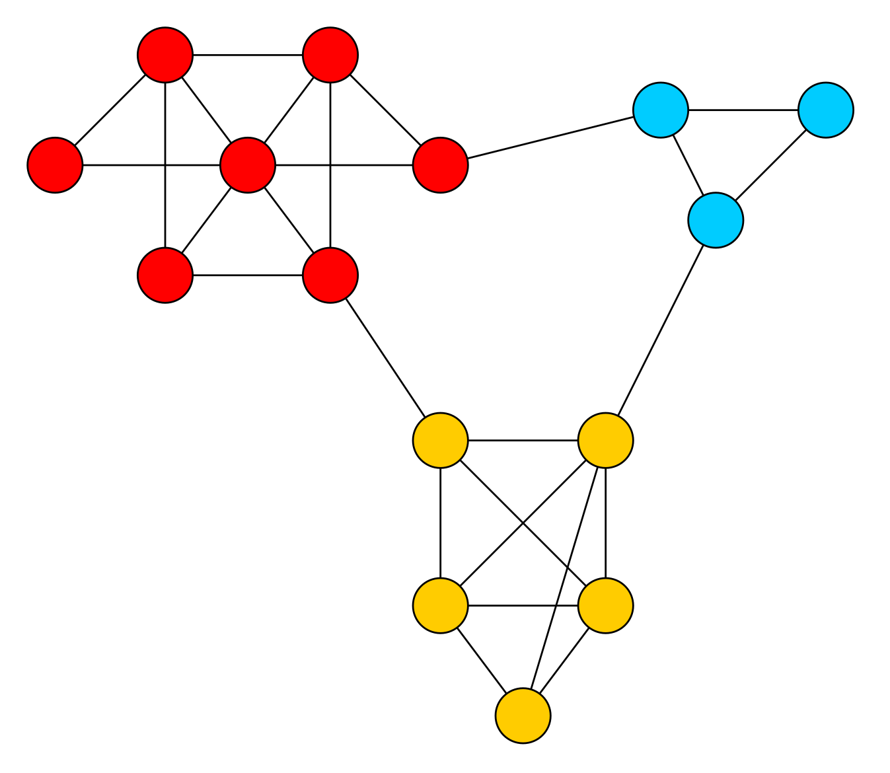

VieClus v1.0 [](https://travis-ci.org/VieClus/VieClus)
[](https://www.codacy.com/gh/VieClus/VieClus/dashboard?utm_source=github.com&amp;utm_medium=referral&amp;utm_content=VieClus/VieClus&amp;utm_campaign=Badge_Grade)
=====

The graph clustering framework VieClus -- Vienna Graph Clustering.

Graph clustering is the problem of detecting tightly connected regions of a
graph. Depending on the task, knowledge about the structure of the graph can
reveal information such as voter behavior, the formation of new trends, existing
terrorist groups and recruitment or a natural partitioning of
data records onto pages. Further application areas
include the study of protein interaction, gene
expression networks, fraud
detection, program optimization and the spread of
epidemics---possible applications are plentiful, as
almost all systems containing interacting or coexisting entities can be modeled
as a graph. 


This is the release of our memetic algorithm, VieClus (Vienna Graph Clustering), to tackle the graph clustering problem. 
A key component of our contribution are natural recombine operators that employ ensemble clusterings as well as multi-level techniques. 
In our experimental evaluation, we show that **our algorithm successfully improves or reproduces all entries of the 10th DIMACS implementation challenge** under consideration in a small amount of time. In fact, for most of the small instances, we can improve the old benchmark result in less than a minute.
Moreover, while the previous best result for different instances has been computed by a variety of solvers, our algorithm can now be used as a single tool to compute the result. **In short our solver is the currently best modularity based clustering algorithm available.**

<p align="center">

</p>

## Main project site:
http://vieclus.taa.univie.ac.at

Installation Notes
=====

Before you can start you need to install the following software packages:

- Argtable (http://argtable.sourceforge.net/)
- OpenMPI (http://www.open-mpi.org/). Note: due to removed progress threads in OpenMPI > 1.8, please use an OpenMPI version < 1.8 or Intel MPI to obtain a scalable parallel algorithm.

Once you installed the packages, just type 
``./compile_withcmake.sh``
Once you did that you can try to run the following command:

``mpirun -n 2 ./deploy/vieclus examples/astro-ph.graph --time_limit=60``

For a description of the graph format please have a look into the manual.


Licence
=====
The program is licenced under MIT licence.
If you publish results using our algorithms, please acknowledge our work by quoting the following paper:

```
@inproceedings{BiedermannHSS18,
             AUTHOR = {Biedermann, Sonja and Henzinger, Monika and Schulz, Christian and Schuster, Bernhard},
             TITLE = {{Memetic Graph Clustering}},
             BOOKTITLE = {{Proceedings of the 17th International Symposium on Experimental Algorithms (SEA'18)}},
             SERIES = {{LIPIcs}},
             PUBLISHER = {Dagstuhl},
             NOTE = {Technical Report, arXiv:1802.07034},
             YEAR = {2018}
}
```

